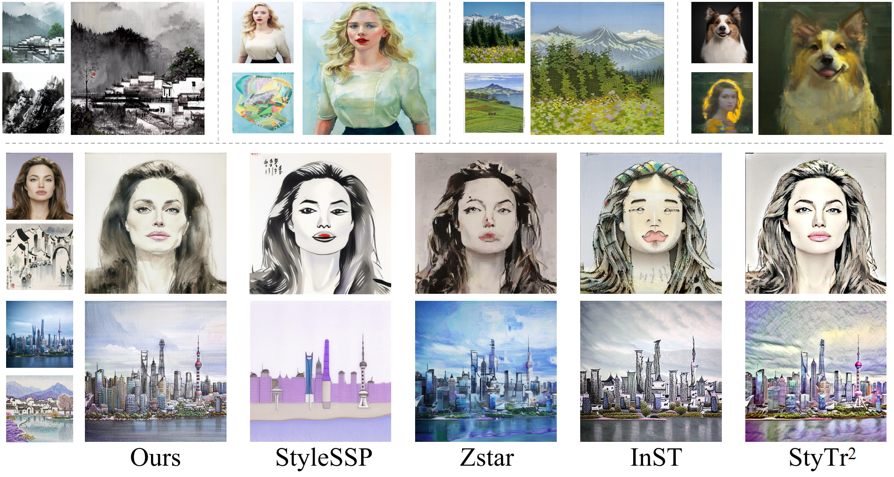

# Inversion-Free-Style-Transfer-with-Dual-Rectified-Flows

## [1] 👀 Preview

Style transfer, a pivotal task in image processing, synthesizes visually compelling images by seamlessly blending realistic content with artistic styles, enabling applications in photo editing and creative design. While mainstream training-free diffusion-based methods have greatly advanced style transfer in recent years, their reliance on computationally inversion processes compromises efficiency and introduces visual distortions when inversion is inaccurate. To address these limitations, we propose a novel \textit{inversion-free} style transfer framework based on dual rectified flows, which tackles the challenge of finding an unknown stylized distribution from two distinct inputs (content and style images), \textit{only with forward pass}. Our approach predicts content and style trajectories in parallel, fusing them through a sophisticated midpoint interpolation that dynamically integrates velocities from both paths while accounting for the evolving stylized image. By concurrently considering the content, style, and stylized distributions, our velocity field construction ensures robust fusion, avoiding the pitfalls of naive content-style overlays. Enhanced by attention injection to guide style integration, our method achieves superior visual fidelity, content preservation, and computational efficiency compared to state-of-the-art approaches. Extensive experiments validate the generalization across diverse styles and content, establishing an efficient pipeline for style transfer tasks. 
The code is coming soon. Stay tuned!
